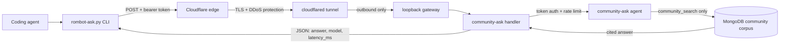

# 🤖 RomBot CLI — AI Agents Community Knowledge

**Ask the AI Agents community brain a question — get grounded, cited answers from ~4,000 developers' real-world experience, right inside your coding agent.**

[](#status)
[](LICENSE)
[](#quickstart)

---

## The problem

Every coding agent can search the web. But web search finds blog posts, docs, and marketing pages — not the **hard-won, battle-tested knowledge** that lives in community conversations. The gotchas people hit at 2am. The repos that actually work vs. the ones that look good on paper. The config that breaks in production. That knowledge is locked in private Discord/WhatsApp groups, invisible to your agent.

RomBot CLI unlocks it. The AI Agents community (~4,000 developers across 4 WhatsApp groups) has been discussing AI coding tools, agent architectures, model comparisons, and real-world deployment for months. This skill lets your coding agent ask that community brain a question and get back a **grounded, cited answer** — with who said it, which group, when, and links to repos or resources mentioned.

---

## Proof it works

Ask a real question through the skill, get a grounded, cited answer:

```
❯ /rombot-cli what's the best model for coding agents

⏺ Skill(rombot-cli) — loaded

**Claude Sonnet** is the community's go-to for coding agents, hands down.
Guy B says Sonnet 5 "works like a bomb with no unnecessary chatter"
(26 Jul 2026). Idan Shimon: "for code? Sonnet, Opus" (22 Feb 2026).

**Strong contender — GPT via Codex:** Ido Ben Ari said his experience with
Codex + GPT 5.3 was *better* than Claude Opus 4.6 (12 Feb 2026). Yogev
downgraded Claude Code spend from $200→$100 and upgraded Codex $20→$100:
"GPT models are much more efficient than Opus" (19 Jun 2026).

**Skip for coding agents:** Google Gemini — Ziv put it bluntly: "good for
chatbots, very bad at instruction following and tool calls" (22 Feb 2026).
Rom Iluz agreed.

**Bottom line:** Start with Sonnet 5. Complexity walls → Opus.
Budget-conscious → GPT 5.3 via Codex. Skip Google for agentic coding.
```

Every claim is sourced — who said it, when, with the repo or context. No hallucinated metrics, no invented best practices — just what the community actually said.

---

## 🎯 Capability pillars

| Pillar                       | What it means                                                                                                        |
| ---------------------------- | -------------------------------------------------------------------------------------------------------------------- |
| 🧠 **Community-grounded**    | Answers mined from ~4,000 developers' real conversations, not web scrapes or synthetic data                          |
| 📎 **Cite-or-die**           | Every claim cites who said it, when, in which group, with links to repos/resources                                   |
| 🔒 **Constrained retrieval** | The agent can ONLY query the public community corpus + KB — never session chunks, private data, or unrelated sources |
| 🔌 **Agent-agnostic**        | Works in Claude Code, Codex, Pi, Cursor, and any Agent Skills-compatible harness                                     |
| 🛡️ **Production-hardened**   | Per-user token auth, rate limiting, in-flight caps, 60s timeout, PII-redacted audit, Cloudflare DDoS protection      |

---

## Quickstart

### 1. Install the skill

```bash
npx skills add romiluz13/rombot-community-skill
```

Works in Claude Code, Codex, Pi, Cursor, and any harness that watches `.agents/skills/`.

### 2. Get a token

Send `/rombot-cli` to **RomBot** on WhatsApp (**+972 55-987-4713**). You'll get a token tied to your phone number — self-service, no need to ask Rom.

### 3. Set up — tell your agent

Your coding agent handles setup. Don't open a terminal. Tell your agent:

> Set up rombot-cli, here's my token: <paste your token>

The agent runs `setup` with your token, writes the config (`~/.config/rombot-cli/.env`), and verifies it. You're done.

### 4. Ask

In your coding agent:

```
/rombot-cli best practices for Claude Code hooks
/rombot-cli what model works best for coding agents
/rombot-cli how to handle context window limits
```

The agent asks RomBot's community brain and passes the answer through **verbatim** (don't reword, summarize, or translate — the citations matter).

---

## Manual / debugging

If your agent isn't available, or you're debugging the install, you can run the CLI directly:

```bash
# Configure (press Enter for the default URL, then paste your token)
python3 skills/rombot-cli/scripts/rombot-ask.py setup

# Ask
python3 rombot-ask.py "What repos do people use for AI agent memory?"
```

This is not the primary path — prefer the agent-driven flow above.

---

## Architecture



The gateway is **never directly exposed**. Cloudflare Tunnel connects outbound only — no open ports, no sudo, automatic HTTPS.

---

## Configuration

| Env var            | Where                              | Description                                                       |
| ------------------ | ---------------------------------- | ----------------------------------------------------------------- |
| `ROMBOT_CLI_URL`   | `~/.config/rombot-cli/.env` or env | Endpoint URL (default: `https://api.rombot.uk/api/community-ask`) |
| `ROMBOT_CLI_TOKEN` | `~/.config/rombot-cli/.env` or env | Your developer bearer token                                       |

**Flags:** `--json` (full `{answer, model, latency_ms}` shape) · `--timeout <s>` (default 90s)

**Exit codes:** 0 success · 1 no answer · 2 auth failed (401) · 3 rate limited (429) · 4 not configured

---

## Status

**Active** — the endpoint is live and answering real questions. Token issuance is self-service: send `/rombot-cli` to RomBot on WhatsApp to get a token tied to your phone number.

Rate limits: 10 requests/hour per token, 50/day. The community corpus is read-only — the agent cannot write, execute commands, or access private sessions.

---

## License

[MIT](LICENSE) — the skill package is open source. The RomBot community corpus and endpoint are operated by Rom Iluz.
